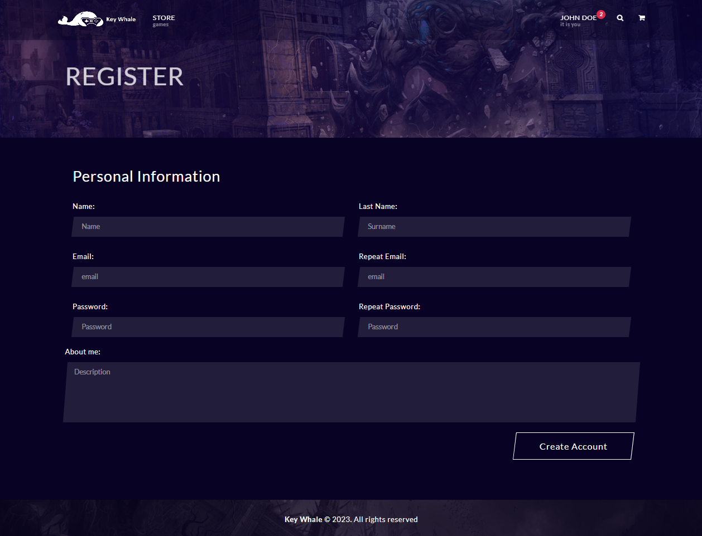
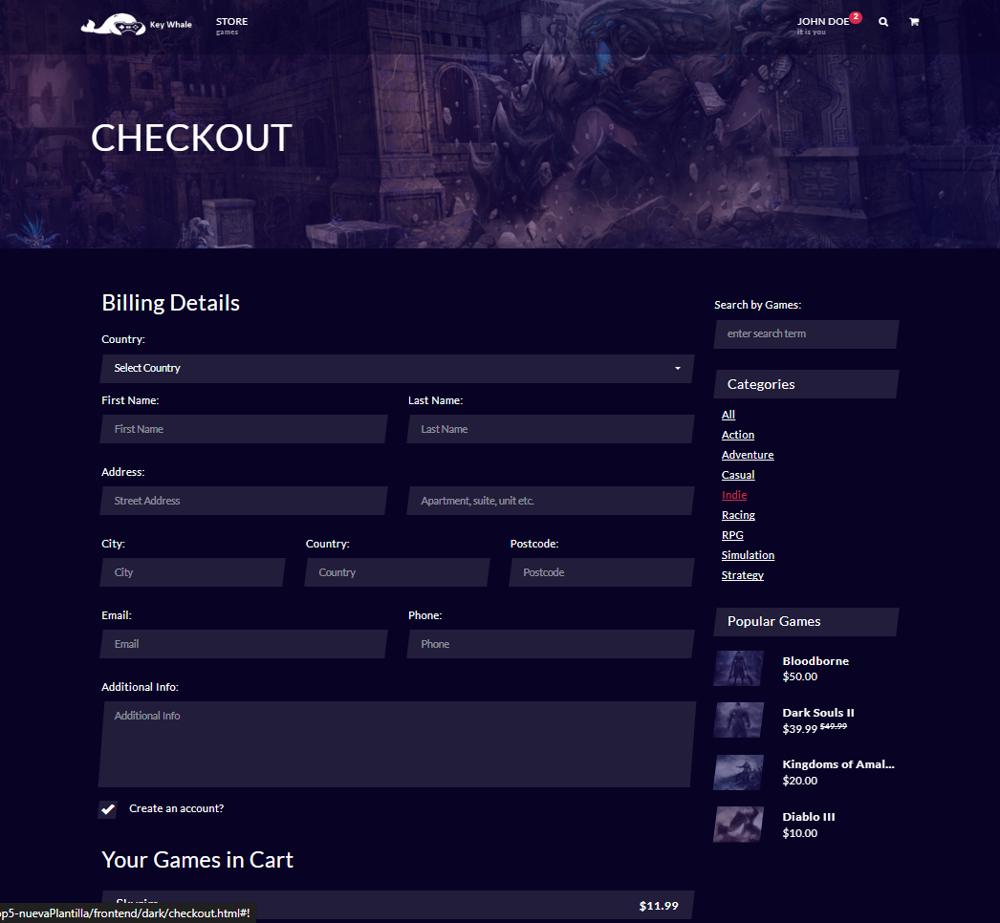

# Key Whale

## Table of contents

- [Phase 0](#phase-0)
    - [Members](#members)
    - [Entities](#entities)
    - [Users](#users)
    - [User permissions](#user-permissions)
    - [Pictures](#pictures)
    - [Charts](#charts)
    - [Complementary Technology](#complementary-technology)
    - [Algorithm](#algorithm)

## Phase 0

### Members

| Name                      | e-mail                            | GitHub username      |
| ------------------------- | --------------------------------- | ---------------      |
| Sergio Pérez Sampedro     | s.perezs.2020@alumnos.urjc.es     | lord-47              |
| Brais Cabo Felpete        | b.cabo.2020@alumnos.urjc.es       | BraisCabo            |
| Javier Gaspariño Muñoz    | j.gasparino.2020@alumnos.urjc.es  | JavierGasparinoMunoz |
| Iker Pizarro Fernández    | i.pizarro.2020@alumnos.urjc.es    | pizarroiker          |
| Sergio Octavio Mancebo    | s.octavio.2018@alumnos.urjc.es    | sergio-octavio       |

### Entities

- User
- Game
- Game Review
- Purchase

#### Users

- **Anonymous**: This type of users will be able to see the games of the sore. However, they will not be able to purchase games and he will not receive recomended games.

- **Registered**: They will be able to purchase games, change user profile picture and review purchased games.

- **Admin**: They will be able to add/delete and edit games. They will also be able to delete and edit reviews of the games and crete new game companies.

### User permissions

Users can write an assessment about a film, having also to rate it. They can modify their assessments at any moment.

### Pictures

The entity ‘Users’ may have one profile picture. The entity 'game company' will have a logo picture. The entity 'game' will have title picture and in game images.

### Charts

There will be a bar chart representing the user stars of the games.

### Complementary Technology

The web page will send emails to users notifying the purchase they have done.

### Algorithm

Search films by title. Furthermore, the application will show games recomendation based on user prefferences.

# Phase 1

## Web pages layout using HTML and CSS

### Unregistered users 

**Initial menu:** 
This is the main page where the user can view his cart, proceed to checkout and view the available games, and can enter their respective pages to view the specifications, screenshots of the game and its features.
 
 
 
 

**Register:** 
Screen that will allow new users to sing up in KeyWhale. 
 
 

**Game:** 
Screen that will display information, images and features about the game. Also, at the bottom of the page reviews of the game will appear. 
 
 
 

**Search:** 
Screen that will display the games that contains the words that you searched. 
 
  

**Cart:** 
Page that shows all the games in the cart showing them, their price, and the total price of the cart.
 
  

**Checkout:** 
Page containing a form for the billing information of the user who is going to buy on the site. Unregistered users should check the checkbox for register a new user.
 
  
   

### Registered users 

**Initial menu:** 
This is the main page where the user can enter his profile, view his cart, proceed to checkout and view the available games, and can enter their respective pages to view the specifications, screenshots of the game and its features.
 
 
 
 
 
**Login:** 
Screen that will allow registered users to log in giving their email and password. All users have access to this screen even though only registered users will be able to end this process. 
 
 

**Register:** 
Screen that will allow new users to sing up in KeyWhale. 
 
 

**Profile:** 
Screen that will display information, profile logo and number of games purchased about the profile.
 

**Game:** 
Screen that will display information, images and features about the game. Also, at the bottom of the page reviews of the game will appear. 
 
 
 

**Search:** 
Screen that will display the games that contains the words that you searched. 
 
  

**Cart:** 
Page that shows all the games in the cart showing them, their price, and the total price of the cart.
 
  

**Checkout:** 
Page containing a form for the billing information of the user who is going to buy on the site. 
 
  
   

### Admin

**Initial menu:** 
This is the main page where the admin can enter his profile, view the available games, and add or delete more games, enter their respective pages to view or change the specifications, screenshots of the game and its features.
 
 
 
 
 

**Profile:** 
Screen that will display information and profile logo.
 

**Game:** 
Screen that will display information, images and features about the game. Also, at the bottom of the page reviews of the game will appear. The admin have control of all the page so he can change any info of the game, delete reviews that are out of context, etc. 
 
 
 

**Search:** 
Screen that will display the games that contains the words that you searched. 
 
  

**GameForm:** 
Screen that will allow admins to add a new game with all its features in KeyWhale.
 

## Navigation Diagram
* Blue = Unregistered users.
* Yellow = Registered users.
* Green = Admins.

# Phase 2

## Navigation

## Execution instructions

## Diagram with database entities

## Class diagram and templates

## Member participation

