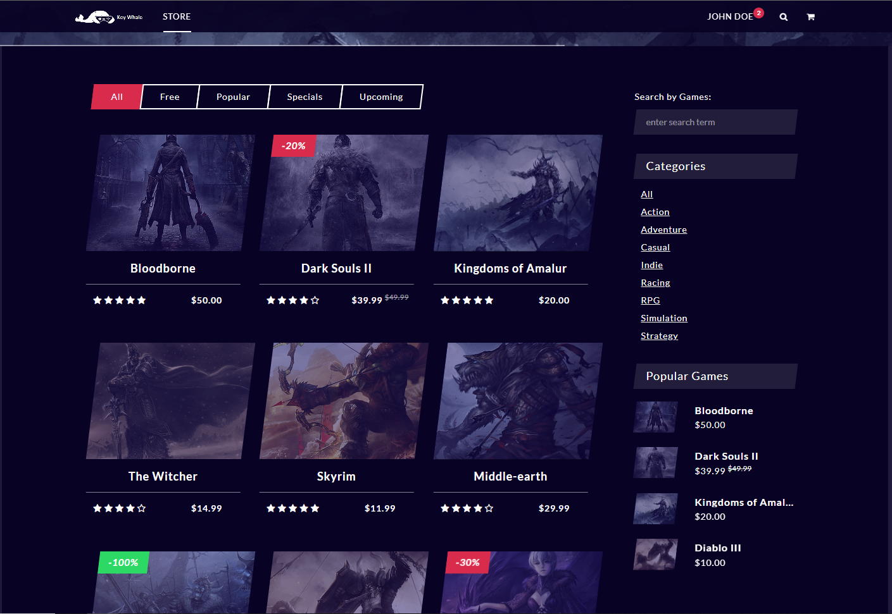
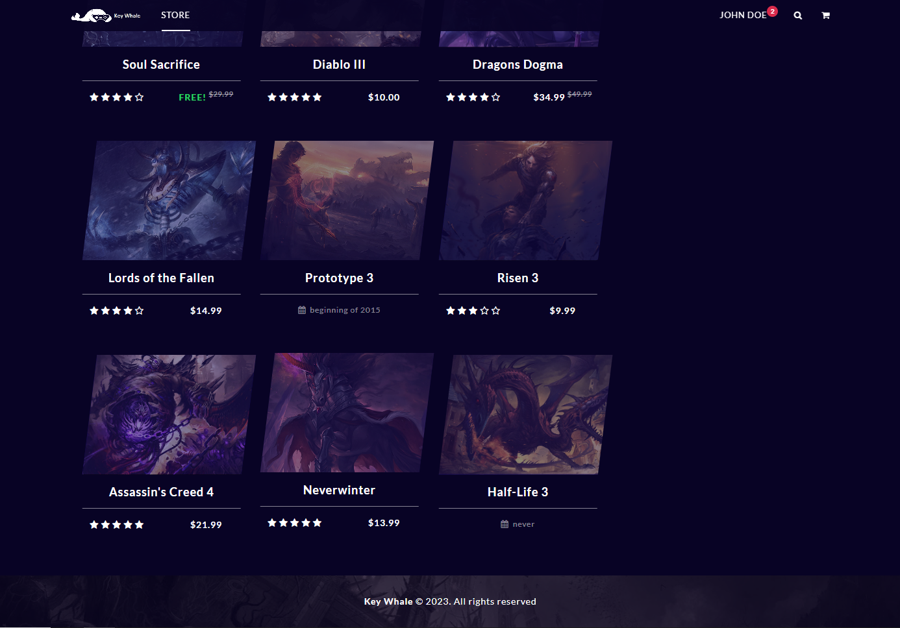
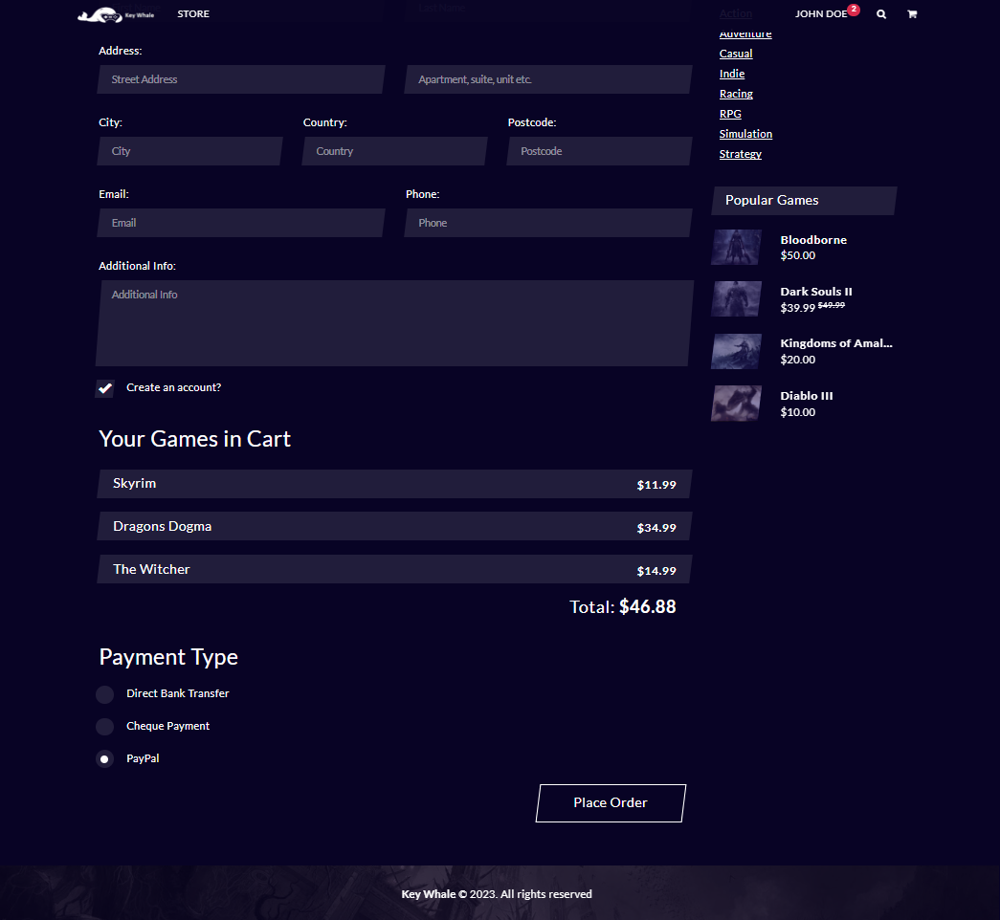
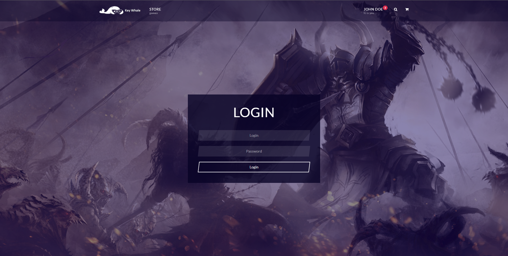
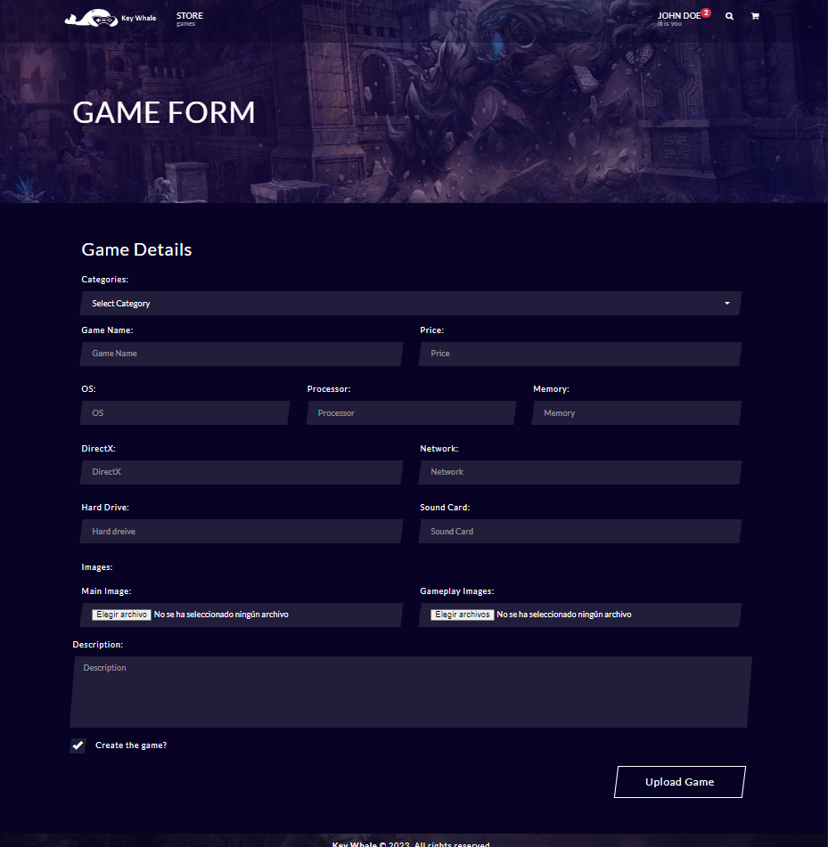

# Key Whale

## Table of contents

- [Phase 0](#phase-0)
    - [Members](#members)
    - [Entities](#entities)
    - [Users](#users)
    - [User permissions](#user-permissions)
    - [Pictures](#pictures)
    - [Charts](#charts)
    - [Complementary Technology](#complementary-technology)
    - [Algorithm](#algorithm)

## Phase 0

### Members

| Name                      | e-mail                            | GitHub username      |
| ------------------------- | --------------------------------- | ---------------      |
| Sergio Pérez Sampedro     | s.perezs.2020@alumnos.urjc.es     | lord-47              |
| Brais Cabo Felpete        | b.cabo.2020@alumnos.urjc.es       | BraisCabo            |
| Javier Gaspariño Muñoz    | j.gasparino.2020@alumnos.urjc.es  | JavierGasparinoMunoz |
| Iker Pizarro Fernández    | i.pizarro.2020@alumnos.urjc.es    | pizarroiker          |
| Sergio Octavio Mancebo    | s.octavio.2018@alumnos.urjc.es    | sergio-octavio       |

### Entities

- User
- Game
- Game Review
- Purchase

#### Users

- **Anonymous**: This type of users will be able to see the games of the sore. However, they will not be able to purchase games and he will not receive recomended games.

- **Registered**: They will be able to purchase games, change user profile picture and review purchased games.

- **Admin**: They will be able to add/delete and edit games. They will also be able to delete and edit reviews of the games and crete new game companies.

### User permissions

Users can write an assessment about a film, having also to rate it. They can modify their assessments at any moment.

### Pictures

The entity ‘Users’ may have one profile picture. The entity 'game company' will have a logo picture. The entity 'game' will have title picture and in game images.

### Charts

There will be a bar chart representing the user stars of the games.

### Complementary Technology

The web page will send emails to users notifying the purchase they have done.

### Algorithm

Search films by title. Furthermore, the application will show games recomendation based on user prefferences.

# Phase 1

## Web pages layout using HTML and CSS

### Unregistered users 

**Initial menu:** 
This is the main page where the user can view his cart, proceed to checkout and view the available games, and can enter their respective pages to view the specifications, screenshots of the game and its features.
 
 
 
 

**Register:** 
Screen that will allow new users to sing up in KeyWhale. 
 
 

**Game:** 
Screen that will display information, images and features about the game. Also, at the bottom of the page reviews of the game will appear. 
 
 
 

**Search:** 
Screen that will display the games that contains the words that you searched. 
 
  

**Cart:** 
Page that shows all the games in the cart showing them, their price, and the total price of the cart.
 
  

**Checkout:** 
Page containing a form for the billing information of the user who is going to buy on the site. Unregistered users should check the checkbox for register a new user.
 
  
   

### Registered users 

**Initial menu:** 
This is the main page where the user can enter his profile, view his cart, proceed to checkout and view the available games, and can enter their respective pages to view the specifications, screenshots of the game and its features.
 
 
 
 
 
**Login:** 
Screen that will allow registered users to log in giving their email and password. All users have access to this screen even though only registered users will be able to end this process. 
 
 

**Register:** 
Screen that will allow new users to sing up in KeyWhale. 
 
 

**Profile:** 
Screen that will display information, profile logo and number of games purchased about the profile.
 

**Game:** 
Screen that will display information, images and features about the game. Also, at the bottom of the page reviews of the game will appear. 
 
 
 

**Search:** 
Screen that will display the games that contains the words that you searched. 
 
  

**Cart:** 
Page that shows all the games in the cart showing them, their price, and the total price of the cart.
 
  

**Checkout:** 
Page containing a form for the billing information of the user who is going to buy on the site. 
 
  
   

### Admin

**Initial menu:** 
This is the main page where the admin can enter his profile, view the available games, and add or delete more games, enter their respective pages to view or change the specifications, screenshots of the game and its features.
 
 
 
 
 

**Profile:** 
Screen that will display information and profile logo.
 

**Game:** 
Screen that will display information, images and features about the game. Also, at the bottom of the page reviews of the game will appear. The admin have control of all the page so he can change any info of the game, delete reviews that are out of context, etc. 
 
 
 

**Search:** 
Screen that will display the games that contains the words that you searched. 
 
  

**GameForm:** 
Screen that will allow admins to add a new game with all its features in KeyWhale.
 

## Navigation Diagram
* Blue = Unregistered users.
* Yellow = Registered users.
* Green = Admins.

# Phase 2

## Navigation

### Unregistered Users

**Initial menu:** 
This is the main page where a user can log in, register if he/she was not already registered, or without doing any of them, see the games but without the possibility to buy them.

 

### Registered Users

**Checkout:**
Page containing a form for the billing information of the user who is going to buy on the site.

### Admin

**Admin Menu:**
This is the main admin page, which an admin will access when logged in.

 

**Game Form:**
Page containing a form to create games.

 
 

**Control Panel:**
On this page the admin can modify or delete any game he selects.

 
 

## Executions instructions

* To start you must download the code from the repository in github, to do this you must go to the link: CodeURJC-DAW-2022-23 /webapp5, once there, you will have to click on <> Code and click on Download ZIP. 

* In order to run it we use Visual Studio, so once the zip is downloaded and unzipped we open it with Visual Studio. To be able to download it, we looked for in Internet Visual Studio and we get in the main page, if we lowered in the page a little we will see the different versions, we will select the version of Visual Studio Code, if when making click the download does not begin, we began it making click in Downoad. Once it is downloaded we install it in our device.

* Before we can run it we need the version of Maven: 4.0.0, the version of Spring Boot 2.6.3, the version of Java 17 and the version of MySQL 8.0.22. Also if we are going to run it in Visual Studio we will need different extensions:

* Once this is done we can run it but for this we must first download Docker Desktop for this we look for this on the internet and access, on this page click on download and ready. 

* Now, we can start Docker Desktop, and once started we go to Visual Studio Code, from here we look almost at the bottom of a file called dockerCommand, copy its contents and paste it into a terminal, this will connect us to the port where the web page and the database of the application. Now we click on the Spring Boot Dasboardy icon and then on Run.

## Diagram with the database entities

## Class diagram and templates

## Group members participation
### Brais Cabo Felpete
#### Textual description: 
Brais had done the data base, starter security, connection with the data base, login, register, sample data of the db, models, edit profile, see profile, game page, add games to cart, cart page, add review, review visualization, intial repositories and initial services.

#### The five most important commits:

| Commit number | Description                                      | Link                                                                                            |
| ------------- | ------------------------------------------------ | ----------------------------------------------------------------------------------------------- |
| #1            | Model creation, Data Base conection and sample data		   | https://github.com/CodeURJC-DAW-2022-23/webapp5/commit/ee0af6f1cd85e2e441085cf31dabd796945e5858 | 
| #2            | Intial App Security | https://github.com/CodeURJC-DAW-2022-23/webapp5/commit/aa2d8b6ce5840f01bf212a732e094ffdc45d4cd5 | 
| #3            | Login and Navbar done (registered + unregistered) | https://github.com/CodeURJC-DAW-2022-23/webapp5/commit/7a20c8bd4f81d111a7ec17f71b7b8d9bbfb5bf4e | 
| #4            | Register, edit profile and see profile	   | https://github.com/CodeURJC-DAW-2022-23/webapp5/commit/4b73d7932c6a5f1e10144a3d425212a16b1a1709 | 
| #5            | Game Page				   | https://github.com/CodeURJC-DAW-2022-23/webapp5/commit/ef0773341c2037ccdd6db699c46d8cf260728093 | 

#### The five most participated files:

| File number | File               |
| ------------- | ------------------ |
| #1            | [AjaxController.java](https://github.com/CodeURJC-DAW-2022-23/webapp5/blame/main/backend/src/main/java/app/controller/AjaxController.java)     | 
| #2            | [LoadButton.js](https://github.com/CodeURJC-DAW-2022-23/webapp5/blame/main/backend/src/main/resources/static/loadButton.js)     | 
| #3            | [UserController.java](https://github.com/CodeURJC-DAW-2022-23/webapp5/blame/main/backend/src/main/java/app/controller/UserController.java)     | 
| #4            | [GameRepository.java](https://github.com/CodeURJC-DAW-2022-23/webapp5/blame/main/backend/src/main/java/app/repository/GameRepository.java)     | 
| #5            | [Navbar.html](https://github.com/CodeURJC-DAW-2022-23/webapp5/blob/main/backend/src/main/resources/templates/Navbar.html)     | 

### Sergio Octavio Mancebo
#### Textual description:
Sergio has created some features of the Administrator Control Panel, such as deleting the game from the website. The functionality of being able to remove your own comment from a game.

#### The five most important commits:

| Commit number | Description                                      | Link                                                                                            |
| ------------- | ------------------------------------------------ | ----------------------------------------------------------------------------------------------- |
| #1            | Delete game on the website	   | https://github.com/CodeURJC-DAW-2022-23/webapp5/commit/f6358ea84cc6ea5addcb63ebcba96f8dbb9a51f4 | 
| #2            | Delete game comment	   | https://github.com/CodeURJC-DAW-2022-23/webapp5/commit/f04114f662d5d49f639eb869b34b77cc98a6aaf3 | 
| #3            | control panel settings, edit game and button to delete game 	   | https://github.com/CodeURJC-DAW-2022-23/webapp5/commit/3cb2636ed03261040175b1ceabfa68ed207bc73a | 
| #4            | searching games + side search 	   | https://github.com/CodeURJC-DAW-2022-23/webapp5/commit/b7789e6ef9db29554fee0b513c85de820f6866f9 | 
| #5            |  add movie ratings, Created delete comment button  	   | https://github.com/CodeURJC-DAW-2022-23/webapp5/commit/ae373389c7a6d4da37453fedfe46132cdacfed08 | 

#### The five most participated files:

| File number | File               |
| ------------- | ------------------ |
| #1            | [AddGameController.java](backend/src/main/java/app/controller/AddGameController.java)     | 
| #2            | [GameController.java](backend/src/main/java/app/controller/GameController.java)     | 
| #3            | [product-info.html](backend/src/main/resources/templates/product-info.html)     | 
| #4            | [ReviewService.java](backend/src/main/java/app/service/ReviewService.java)     | 
| #5            | [controlPanel.html](backend/src/main/resources/templates/controlPanel.html)     |

### Iker Pizarro Fernández
#### Textual description:
Iker has created some funcionalities for the administrator, such as create a new game and edit a game from the website. He also participates in the recommendation algorythm doing the controller and the frontend part.

#### The five most important commits:

| Commit number | Description                                      | Link                                                                                            |
| ------------- | ------------------------------------------------ | ----------------------------------------------------------------------------------------------- |
| #1            | Create Game  | https://github.com/CodeURJC-DAW-2022-23/webapp5/commit/df0f6d4ae4ffe805f5cad6031df9a4ec81e452fa | 
| #2            | Create Game with Images | https://github.com/CodeURJC-DAW-2022-23/webapp5/commit/001bb156675f9a26bd2923d81363647aaabef9a3  | 
| #3            | Edit Game Backend | https://github.com/CodeURJC-DAW-2022-23/webapp5/commit/6743ce40950435145b253a1ab13f405d0179ace7 |
| #4            | Edit Game Frontend   | https://github.com/CodeURJC-DAW-2022-23/webapp5/commit/c529ef3d2a69ad90790dcdec236c707411d8b317 | 
| #5            | Algorythm Controller | https://github.com/CodeURJC-DAW-2022-23/webapp5/commit/750e2d81a02e84ebb36d3edce42d37436c2658af | 

#### The five most participated files:

| File number | File               |
| ------------- | ------------------ |
| #1            |  [AddGameController.java](backend/src/main/java/app/controller/AddGameController.java)     | 
| #2            |  [newGame.html](backend/src/main/resources/templates/newGame.html)  | 
| #3            |  [editGame.html](backend/src/main/java/app/controller/editGame.html)    | 
| #4            |  [product-info.html](backend/src/main/resources/templates/product-info.html)    | 
| #5            |  [IndexController.java](backend/src/main/java/app/controller/IndexController.java)  |

### Sergio Pérez Sampedro
#### Textual description:
Sergio has conect the back wich the front. This includes the grafics, games of database and algorithm.
 
#### The five most important commits:

| Commit number | Description                                      | Link                                                                                            |
| ------------- | ------------------------------------------------ | ----------------------------------------------------------------------------------------------- |
| #1            | Add the graphic  | https://github.com/CodeURJC-DAW-2022-23/webapp5/commit/c5870e3477cd2ec81c469b09ce8e5b6d607a8f30 | 
| #2            | Conect the back to the main without bugs  | https://github.com/CodeURJC-DAW-2022-23/webapp5/commit/4f5765431d7e8721ed0d8db98fcb60b681ac34d4 | 
| #3            | Load more games  | https://github.com/CodeURJC-DAW-2022-23/webapp5/commit/8f3fff474fcd426ebf4e9ee7613c91a01f464727 | 
| #4            | Recommended algorithm	   | https://github.com/CodeURJC-DAW-2022-23/webapp5/commit/4e6684922fb3b6fc8a4c9bde6ed29222d2635c5e | 
| #5            | All star done	   | https://github.com/CodeURJC-DAW-2022-23/webapp5/commit/d86dc821d7b320504c543d0d791e632482eccc3e | 

#### The five most participated files:

| File number | File               |
| ------------- | ------------------ |
| #1            | [product-info.html](backend/src/main/resources/templates/product-info.html)     | 
| #2            | [index.html](backend/src/main/resources/templates/index.html)     | 
| #3            | [IndexController.java](backend/src/main/java/app/controller/IndexController.java)     | 
| #4            | [GameRepository.java](/backend/src/main/java/app/repository/GameRepository.java)     | 
| #5            | [GameService.java](/backend/src/main/java/app/service/GameService.java)     |

### Javier Gaspariño Muñoz
#### Textual description:
Javier has mainly created the checkout functionalities and also the loading plus games and reviews.

#### The five most important commits:

| Commit number | Description                                      | Link                                                                                            |
| ------------- | ------------------------------------------------ | ----------------------------------------------------------------------------------------------- |
| #1            | Checkout Backend and Frontend, first update   | https://github.com/CodeURJC-DAW-2022-23/webapp5/commit/67cf44dcb955aade41d7bc003198b77d0e9996a8 | 
| #2            | Fix in the checkout links	   | https://github.com/CodeURJC-DAW-2022-23/webapp5/commit/726084764f1b83f61d5fd290577df2e14a3448e3 | 
| #3            | Save data entered at checkout at a later time	   | https://github.com/CodeURJC-DAW-2022-23/webapp5/commit/770201f4aac34a5eecdd5a708e2c6e87df5a1812#diff-ebbfe20c1e31991e367ec7ea57103db132958dc5591a554261426f43209736d8 | 
| #4            | Sending mail with information after checkout	   | https://github.com/CodeURJC-DAW-2022-23/webapp5/commit/f9dc524b2f87c5a11a96ba59bc463e27460b18c5 | 
| #5            | Option to upload more games and more reviews	   | https://github.com/CodeURJC-DAW-2022-23/webapp5/commit/2c82ab98886febb3a83ed25b291b340ed898c578#diff-753f0f62b5bf636c1770d655e62d292c8eb00e56e85939e0b8d3079209869f28 | 

#### The five most participated files:

| File number | File               |
| ------------- | ------------------ |
| #1            | [CheckoutController.java](backend/src/main/java/app/controller/CheckoutController.java)     | 
| #2            | [checkout.html](backend/src/main/resources/templates/checkout.html)     | 
| #3            | [EmailDetails.java](backend/src/main/java/app/Email/EmailDetails.java)     | 
| #4            | [EmailServiceImpl.java](backend/src/main/java/app/Email/EmailServiceImpl.java)     | 
| #5            | [moreGames.html](backend/src/main/resources/templates/moreGames.html)     |

# Phase 3
## App deployed on Railway

https://codeurjc-daw-2022-23-webapp5-production.up.railway.app/

### Example users credentials

**email**: user1lastname1@gmail.com  -  **Password**: 12345678.

**Username**: admin1adminLastName1@gmail.com  -  **Password**: 12345678.

## API REST Documentation

https://github.com/url_de_la_movida_esta

https://raw.githack.com/url_de_la_movida_esta

## Instructions for executing the dockerized app
In order to execute the dockerized app you should follow the next steps:
1.	Install Docker Desktop or Docker in linux.
2.	Open any shell of type "bash".
3.	Clone this repository using the command "git clone https://github.com/CodeURJC-DAW-2022-23/webapp5.git".
4.	Execute the command cd/webapp5/code/docker.
5.	Execute the command "docker-compose up" on the shell.
6.	When the app is running, open any browser and search "https://localhost:8443".

## Instructions for constructing the docker image
In order to create the docker image you should follow the next steps:
1.	Install Docker Desktop or Docker in linux.
2.	Create and account on Dockerhub or connect to your account.
3.	Open any shell of type "bash".
4.	Clone this repository using the command "git clone https://github.com/CodeURJC-DAW-2022-23/webapp5.git".
5.	Execute the command cd/webapp5/code/docker.
6.	Execute the command "./create_image.sh DockerhubUsername/ImageName".

## Instructions for deploying the app on Railway
In order to deploy the app on Railway you should follow the next steps:
1.	Create an account on Railway.
2.	Install Railway package.
3.	Open any shell of type "bash".
4.	Login on Railway using the command "railway login".
5.  Execute the command "railway init" to create a new project.
6.  Execute the command "railway add" and select the mysql option.
7.  In the project dashboard in Railway page add the variable: SERVER_SSL_ENABLED=false
8.  Execute the command "cd code".
9.  Execute the command "railway up".
10. In the project dashboard open the project and stablish a domain.

## Class diagram and templates

## Group members participation
### Brais Cabo Felpete
#### Textual description: 

#### The five most important commits:

| Commit number | Description                                      | Link                                                                                            |
| ------------- | ------------------------------------------------ | ----------------------------------------------------------------------------------------------- |
| #1            | Postman Collection | https://github.com/CodeURJC-DAW-2022-23/webapp5/commit/4d95a15a725d74cd0e0506cce1de7a8bdd8170f5 |
| #2            | DockerFile Creation  | https://github.com/CodeURJC-DAW-2022-23/webapp5/commit/3524e64406457b8f26686f8bf8d5a1410784ac89  | 
| #3            | Docker-Compose | https://github.com/CodeURJC-DAW-2022-23/webapp5/commit/c67963e6ae822ee53a09b7d1f833f0e649e8f463 | 
| #4            | Railway Deployment | https://github.com/CodeURJC-DAW-2022-23/webapp5/commit/4a1c9331a04f5389e03d0df519fbd5eaf01ebc81 | 
| #5            | Api Rest Security | https://github.com/CodeURJC-DAW-2022-23/webapp5/commit/955e908e5a60719a830d9aca754e02c71e2ce358 | 

#### The five most participated files:

| File number | File               |
| ------------- | ------------------ |
| #1            | [Dockerfile](code/docker/Dockerfile) | 
| #2            | [docker-compose.yml](code/docker/docker-compose.yml)     | 
| #3            | [railway.toml](code/railway.toml) | 
| #4            | [KeyWhale.postman_collection.json](KeyWhale.postman_collection.json) | 
| #5            | [RestSecurityConfig.java](code/backend/src/main/java/app/security/RestSecurityConfig.java) |

### Sergio Octavio Mancebo
#### Textual description: 

#### The five most important commits:

| Commit number | Description                                      | Link                                                                                            |
| ------------- | ------------------------------------------------ | ----------------------------------------------------------------------------------------------- |
| #1            | 		   |  | 
| #2            |  |  | 
| #3            | |  | 
| #4            |  | | 
| #5            | | | 

#### The five most participated files:

| File number | File               |
| ------------- | ------------------ |
| #1            | | 
| #2            |     | 
| #3            | | 
| #4            | | 
| #5            | | 

### Iker Pizarro Fernández
#### Textual description: 

#### The five most important commits:

| Commit number | Description                                      | Link                                                                                            |
| ------------- | ------------------------------------------------ | ----------------------------------------------------------------------------------------------- |
| #1            | ReviewRestController First Creation and GetMapping		   | https://github.com/CodeURJC-DAW-2022-23/webapp5/commit/ecdd779cf5e670b8d524a278014c849b1b4bfda7 | 
| #2            | ReviewRestController Post Mapping	 | https://github.com/CodeURJC-DAW-2022-23/webapp5/commit/42067bcfad5ce6838b1e5ac9f0e4a509d91aa29d  | 
| #3            | ReviewRestController Last Version with DeleteMapping	| https://github.com/CodeURJC-DAW-2022-23/webapp5/commit/3febca6d4894979c5bb6ae59eb53ca37254e0748 | 
| #4            | GameRestController First Creation and API functions for create and show game| https://github.com/CodeURJC-DAW-2022-23/webapp5/commit/4300fef5a840ffc0615f8eb58e7173692b13f5da | 
| #5            | GameRestController Last version with API functions for edit game| https://github.com/CodeURJC-DAW-2022-23/webapp5/commit/14eb011f5282e8cd9e525aed1e40fd98a4a0fffd | 

#### The five most participated files:

| File number | File               |
| ------------- | ------------------ |
| #1            | [ReviewRestController](code/backend/src/main/java/app/controller/restController/ReviewRestController.java) | 
| #2            | [GameRestController](code/backend/src/main/java/app/controller/restController/GameRestController.java)   | 
| #3            | [Readme](README.md) | 
| #4            | | 
| #5            | | 

### Sergio Pérez Sampedro
#### Textual description: 

#### The five most important commits:

| Commit number | Description                                      | Link                                                                                            |
| ------------- | ------------------------------------------------ | ----------------------------------------------------------------------------------------------- |
| #1            | 		   |  | 
| #2            |  |  | 
| #3            | |  | 
| #4            |  | | 
| #5            | | | 

#### The five most participated files:

| File number | File               |
| ------------- | ------------------ |
| #1            | | 
| #2            |     | 
| #3            | | 
| #4            | | 
| #5            | | 

### Javier Gaspariño Muñoz
#### Textual description: 

#### The five most important commits:

| Commit number | Description                                      | Link                                                                                            |
| ------------- | ------------------------------------------------ | ----------------------------------------------------------------------------------------------- |
| #1            | UserRestController First Creation and Changes | https://github.com/CodeURJC-DAW-2022-23/webapp5/commit/602f03779c8c08938a3da5c7b11c5dc35f0a7009 | 
| #2            | UserRestController Functions and More Changes | https://github.com/CodeURJC-DAW-2022-23/webapp5/commit/664ef2ac3158651ce3cd7e858d4c6c72571390eb | 
| #3            | UserRestController Ultimate Changes | https://github.com/CodeURJC-DAW-2022-23/webapp5/commit/71c876c20ec859c71d7d1b67f984fa2f4b0bd0d9 | 
| #4            | UserProfile | https://github.com/CodeURJC-DAW-2022-23/webapp5/commit/e0e05ff92be04c1f84f163c7b81545f9c48bc8ce | 
| #5            | Class Diagram Updated Added | https://github.com/CodeURJC-DAW-2022-23/webapp5/commit/517eb57ccc78b8034b3e431eb30cb6e060b4c3b0 | 

#### The five most participated files:

| File number | File               |
| ------------- | ------------------ |
| #1            | [UserRestController](code/backend/src/main/java/app/controller/restController/UserRestController.java) | 
| #2            | [UserProfile](code/backend/src/main/java/app/model/modelRest/UserProfile.java) |
| #3            | [ClassDiagram](screenshots/DiagramaDeClases3.png)| 
| #4            | [Readme](README.md) | 
| #5            | | 
